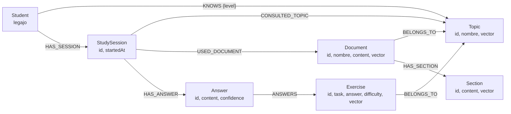

### Domain model overview

- **Student**
  - **properties**: legajo
  - **rels**:
    - Student-[:KNOWS {level: 0..1}]->Topic
    - Student-[:HAS_SESSION]->StudySession
- **Topic**
  - **properties**: id, nombre, vector
  - **rels**:
    - Document-[:BELONGS_TO]->Topic
    - Exercise-[:BELONGS_TO]->Topic
    - StudySession-[:CONSULTED_TOPIC]->Topic
- **Document**
  - **properties**: id, nombre, content, vector
  - **rels**:
    - Document-[:BELONGS_TO]->Topic
    - Document-[:HAS_SECTION]->Section
    - StudySession-[:USED_DOCUMENT]->Document
- **Section**
  - **properties**: id, content, vector
  - **rels**:
    - Document-[:HAS_SECTION]->Section
- **Exercise**
  - **properties**: id, task, answer, difficulty, vector
  - **rels**:
    - Exercise-[:BELONGS_TO]->Topic
    - Answer-[:ANSWERS]->Exercise
- **StudySession**
  - **properties**: id, startedAt
  - **rels**:
    - Student-[:HAS_SESSION]->StudySession
    - StudySession-[:CONSULTED_TOPIC]->Topic
    - StudySession-[:USED_DOCUMENT]->Document
    - StudySession-[:HAS_ANSWER]->Answer
- **Answer**
  - **properties**: id, content, confidence
  - **rels**:
    - Answer-[:ANSWERS]->Exercise

### ASCII graph sketch

```text
Student(legajo)
  ├─[:KNOWS {level}]-> Topic(id, nombre, vector)
  │                         ^              ^
  │                         │              └─ Document(id, nombre, content, vector)
  │                         │                    └─[:HAS_SECTION]-> Section(id, content, vector)
  │                         └─ Exercise(id, task, answer, difficulty, vector)
  │
  └─[:HAS_SESSION]-> StudySession(id, startedAt)
                       ├─[:CONSULTED_TOPIC]-> Topic
                       ├─[:USED_DOCUMENT]-> Document
                       └─[:HAS_ANSWER]-> Answer(id, content, confidence)
                                           └─[:ANSWERS]-> Exercise
```

### Mermaid diagram


